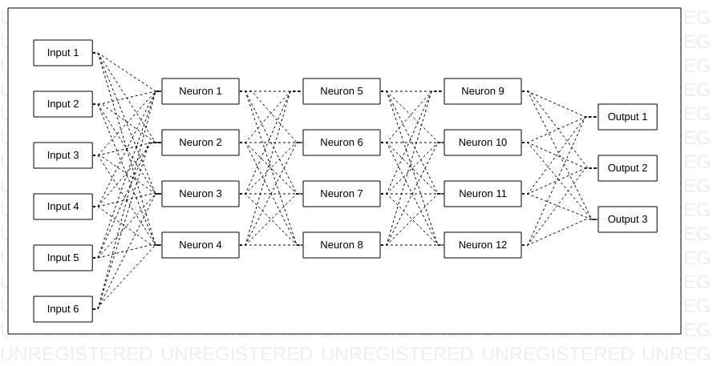

# NeuralNetworkJS

Netural network in JS

## How to install

```
$ npm install neuralnetworkjs
```

in HTML file, include script

```
<script type="text/javascript" src="node_modules/neuralnetworkjs/src/neural-network.js"></script>
```

## How to use

in this example, imagine this:



```
// weightSeq are the weights to apply. If null is generated.
var context = {
    weightSeq: null
};

// "matrix" is a list of weights to apply. If the length of the "matrix" list is different from the total "matrix weights", it will be ignored and "context.weightSeq" will be used.
var matrix = [];

// "input" data to input
var input = [1, 5, 20, 4, 204, 43];

// "hiddenColumn" hidden columns of neurons
var hiddenColumn = 3;

// "hiddenRow" hidden rows of neurons
var hiddenRow = 4;

// "outputColumns" output options. Return array integer 0 or 1, ex: [1, 0, 1]
var outputColumns = 3;

// "outputData" is a callback function to see output result
var outputData = function(output) {
    console.log(output); // ex: [1, 0, 1]
}

// Execute neural network
NeuralNetwork.exec(context, matrix, input, hiddenColumn, hiddenRow, outputColumns, outputData);
```